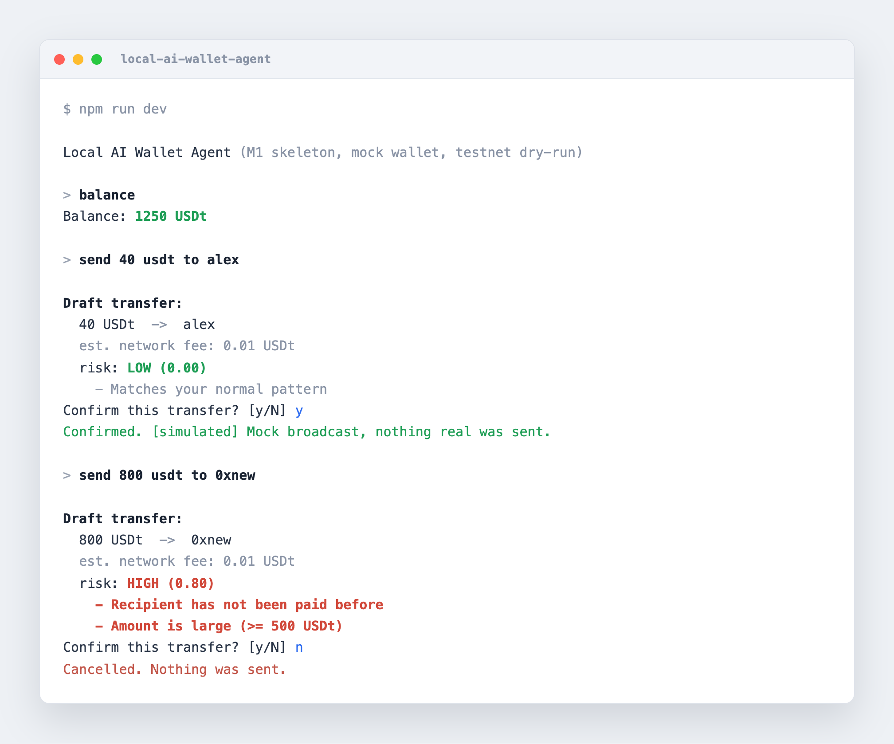

# Local AI Wallet Agent

[](https://github.com/ss1738/local-ai-wallet-agent/actions/workflows/ci.yml)
[](LICENSE)

An on-device AI agent for self-custodial payments. You ask in plain language, it drafts the wallet operation, checks it for risk locally, and does nothing until you confirm. No cloud, no custody of your keys.

Built to run on Tether's open stack: QVAC for on-device AI and WDK for the self-custodial wallet. This repository currently ships a runnable skeleton with mock adapters so the full flow works today. The QVAC and WDK integrations land per the roadmap below.

## Demo



It approves a normal payment, then flags a large transfer to a brand-new recipient as HIGH risk and holds it at the confirmation gate.

## Status

M1 in progress. The end-to-end flow runs on a mock wallet with rule-based parsing by default, and both real integrations are wired as opt-in:

- `WALLET_MODE=wdk` connects a **real WDK self-custodial wallet** that derives a real address and reads a live Sepolia testnet balance.
- `AI_MODE=qvac` parses intent with a **small on-device LLM via QVAC** (Llama 3.2 1B, quantized), no cloud.

After you confirm, a transfer is broadcast: a real send on the WDK testnet wallet, or a simulated send on the mock wallet. Nothing is ever sent without confirmation. A rule-based risk gate stands in for the trained anomaly model, which arrives with RAG spending insights in M2.

## Why

Wallet UX assumes a human clicking through forms, and AI money assistants almost always run in the cloud and take custody of keys. This does the opposite: the intelligence runs on your device (QVAC) and you always hold your keys (WDK). The agent only proposes; you decide.

## Safety model

- No custody. The wallet layer holds the keys; the agent can propose but never independently move funds.
- Human in the loop. Every transfer stops at an explicit confirmation. No silent or automatic sends.
- Bounded action space. The model's output is mapped to a fixed set of vetted operations in deterministic code. A wrong or manipulated model cannot invent an action.
- On-device risk gate. Unusual transfers are flagged before confirmation. Limits are enforced in code, not by the model.
- Testnet first, local by default. No transaction data leaves the device.

## Architecture

```
natural language
      |
  intent parser        rule-based now, QVAC LLM later
      |
  policy engine         deterministic: bounded operations, hard limits
      |
   +--+----------------+
   |                   |
 read / draft        risk engine
 via wallet          rule-based now, trained model in M2
 (WDK later)
      |
 confirmation gate     human in the loop
      |
 dry-run (M1) or signed WDK broadcast (later)
```

The model reaches the wallet through the policy layer only. It proposes an intent; deterministic code decides the operation and enforces the limits.

## Run

Requires Node 20 or newer (QVAC will require Node 22 once wired).

```
npm install
npm run dev
```

Then try:

```
balance
history
send 40 usdt to alex
send 800 usdt to 0xnewaddress
```

The last one is flagged as higher risk (new recipient, large amount) and still stops for your confirmation before doing anything.

### Real wallet (Sepolia testnet)

By default the agent uses a mock wallet so it runs offline. To connect a real self-custodial WDK wallet on the Sepolia testnet:

```
WALLET_MODE=wdk npm run dev
```

On first run it generates a testnet seed and saves it to `.wallet/seed.json` (gitignored, testnet only). It prints your address; run `address` to see it again, fund it from a Sepolia faucet, then `balance` reads the live on-chain balance. Keys stay on your device (WDK holds them). After you confirm, a transfer to a valid `0x` address is signed and broadcast to Sepolia (fund the wallet from a faucet first, or the send is rejected for insufficient funds).

### On-device AI (QVAC)

By default, intent parsing is rule-based so it runs with no model. To parse requests with a real on-device LLM (no cloud), install QVAC and enable it:

```
npm install @qvac/sdk
AI_MODE=qvac npm run dev
```

The first request downloads a small quantized model (Llama 3.2 1B) and runs it locally. The model only proposes an intent; the deterministic policy layer still validates and bounds every action. If the model is unavailable it falls back to rule-based parsing, so the agent never breaks. Runs best on Apple Silicon.

## Roadmap

- M1 (complete): wallet and AI foundation. Natural language to intent, deterministic policy, on-device risk gate, human confirmation, and real testnet signing and broadcast via WDK, plus optional on-device QVAC intent parsing.
- M2: on-device transaction risk model and retrieval-augmented spending insights over local history.
- M3: Expo mobile app (self-custodial via WDK), documentation, threat model, tagged release.

## License

Apache-2.0. See [LICENSE](LICENSE).
